# Data Model (AI)

## 1. Database Diagram

```mermaid
erDiagram
    COURSE ||--o{ BOOK : has
    COURSE ||--o{ CAPSTONE : has
    COURSE ||--o{ COHORTCOURSE : part_of
    BOOK ||--o{ PROJECT : contains
    BOOK ||--o{ ASSESSMENT : contains
    PROJECT ||--o{ STUDENTPROJECT : assigned_to
    PROJECT ||--o{ PROJECTTAG : tagged_with
    PROJECT ||--o{ PROJECTNOTE : has
    PROJECT ||--o{ GROUPPROJECTREPOSITORY : has

    NSSUSER ||--o{ STUDENTPROJECT : completes
    NSSUSER ||--o{ CAPSTONE : creates
    NSSUSER ||--o{ STUDENTASSESSMENT : completes
    NSSUSER ||--o{ STUDENTNOTE : receives
    NSSUSER ||--o{ ONEONONENOTE : receives
    NSSUSER ||--o{ STUDENTTAG : has
    NSSUSER ||--o{ STUDENTMENTOR : has_mentor
    NSSUSER ||--o{ STUDENTMENTOR : is_mentor
    NSSUSER ||--o{ STUDENTPERSONALITY : has
    NSSUSER ||--o{ LEARNINGRECORD : has
    NSSUSER ||--o{ CORESKILLRECORD : has
    NSSUSER ||--o{ NSSUSERTEAM : in_team
    NSSUSER ||--o{ NSSUSERTEAM : leads_team
    NSSUSER ||--o{ NSUSERCOHORT : assigned_to
    NSSUSER ||--o{ PROJECTNOTE : writes
    NSSUSER ||--o{ CORESKILLRECORDENTRY : records
    NSSUSER ||--o{ LEARNINGRECORDENTRY : records
    NSSUSER ||--o{ OPPORTUNITY : coaches
    NSSUSER ||--o{ OPPORTUNITYUSER : interested_in

    COHORT ||--|| COHORTINFO : has
    COHORT ||--o{ COHORTCOURSE : has
    COHORT ||--o{ NSUSERCOHORT : has_members
    COHORT ||--o{ STUDENTTEAM : has
    COHORT ||--o{ OPPORTUNITY : offers
    COHORT ||--o{ COHORTEVENT : has

    STUDENTTEAM ||--o{ NSSUSERTEAM : contains
    STUDENTTEAM ||--o{ GROUPPROJECTREPOSITORY : has

    ASSESSMENT ||--o{ STUDENTASSESSMENT : assigned_to
    ASSESSMENT ||--o{ ASSESSMENTWEIGHT : has
    ASSESSMENT ||--o{ ASSESSMENTOBJECT : has_objectives

    STUDENTASSESSMENT ||--|| STUDENTASSESSMENTSTATUS : has_status

    STUDENTNOTE ||--|| STUDENTNOTETYPE : has_type

    TAG ||--o{ PROJECTTAG : tags
    TAG ||--o{ LIGHTNINGTAG : tags
    TAG ||--o{ OBJECTIVETAG : tags
    TAG ||--o{ STUDENTTAG : tags

    LEARNINGOBJECTIVE ||--o{ OBJECTIVETAG : tagged_with
    LEARNINGOBJECTIVE ||--|| TAXONOMYLEVEL : has_level
    LEARNINGOBJECTIVE ||--o{ ASSESSMENTOBJECT : in_assessment

    LIGHTNINGEXERCISE ||--o{ LIGHTNINGTAG : tagged_with

    CAPSTONE ||--|| PROPOSALSTATUS : current_status
    CAPSTONE ||--o{ CAPSTONETIMELINE : has_timeline
    CAPSTONE ||--o{ STUDENTMENTOR : has_mentor

    CAPSTONETIMELINE ||--|| PROPOSALSTATUS : status

    LEARNINGWEIGHT ||--o{ LEARNINGRECORD : evaluates
    LEARNINGWEIGHT ||--o{ ASSESSMENTWEIGHT : used_in

    LEARNINGRECORD ||--o{ LEARNINGRECORDENTRY : has_entries

    CORESKILL ||--o{ CORESKILLRECORD : evaluates

    CORESKILLRECORD ||--o{ CORESKILLRECORDENTRY : has_entries

    COHORTEVENTTYPE ||--o{ COHORTEVENT : categorizes

    OPPORTUNITY ||--o{ OPPORTUNITYUSER : interests

    COHORTGITHUBPROJECT ||--|| COHORT : links

    FOUNDATIONSEXERCISE {
        int id
        string learner_github_id
        string learner_name
        string title
        string slug
        int attempts
        bool complete
        datetime completed_on
        datetime first_attempt
        datetime last_attempt
        text completed_code
        bool used_solution
    }

    FOUNDATIONSLEARNERPROFILE {
        int id
        string learner_github_id
        string learner_name
        string cohort_type
        int cohort_number
    }

    COURSE {
        int id
        string name
        date date_created
        bool active
    }

    BOOK {
        int id
        string name
        int course_id FK
        text description
        int index
    }

    PROJECT {
        int id
        string name
        string implementation_url
        string client_template_url
        string api_template_url
        int book_id FK
        int index
        bool active
        bool is_group_project
    }

    STUDENTPROJECT {
        int id
        int student_id FK
        int project_id FK
        date date_created
    }

    CAPSTONE {
        int id
        int student_id FK
        int course_id FK
        string proposal_url
        string repo_url
        text description
    }

    CAPSTONETIMELINE {
        int id
        int capstone_id FK
        int status_id FK
        datetime date
    }

    PROPOSALSTATUS {
        int id
        string status
    }

    LEARNINGOBJECTIVE {
        int id
        string swbat
        int bloom_level_id FK
    }

    TAXONOMYLEVEL {
        int id
        string level_name
    }

    OBJECTIVETAG {
        int id
        int objective_id FK
        int tag_id FK
    }

    PROJECTTAG {
        int id
        int project_id FK
        int tag_id FK
    }

    LIGHTNINGTAG {
        int id
        int exercise_id FK
        int tag_id FK
    }

    LIGHTNINGEXERCISE {
        int id
        string name
        text description
    }

    PROJECTNOTE {
        int id
        int user_id FK
        int project_id FK
        text note
    }

    TAG {
        int id
        string name
    }

    NSSUSER {
        int id
        int user_id FK
        string slack_handle
        string github_handle
    }

    COHORT {
        int id
        string name
        string slack_channel
        date start_date
        date end_date
        date break_start_date
        date break_end_date
        bool active
    }

    COHORTINFO {
        int id
        int cohort_id FK
        string student_organization_url
        string github_classroom_url
        string attendance_sheet_url
        string client_course_url
        string server_course_url
        string zoom_url
    }

    COHORTCOURSE {
        int id
        int cohort_id FK
        int course_id FK
        bool active
        int index
    }

    NSUSERCOHORT {
        int id
        int nss_user_id FK
        int cohort_id FK
        bool is_github_org_member
    }

    STUDENTTEAM {
        int id
        string group_name
        int cohort_id FK
        bool sprint_team
        string slack_channel
    }

    NSSUSERTEAM {
        int id
        int team_id FK
        int student_id FK
    }

    ASSESSMENT {
        int id
        string name
        string source_url
        int book_id FK
        string type
    }

    STUDENTASSESSMENT {
        int id
        int student_id FK
        int assessment_id FK
        int status_id FK
        int instructor_id FK
        string url
        date date_created
    }

    STUDENTASSESSMENTSTATUS {
        int id
        string status
    }

    ASSESSMENTWEIGHT {
        int id
        int weight_id FK
        int assessment_id FK
    }

    ASSESSMENTOBJECT {
        int id
        int assessment_id FK
        int objective_id FK
    }

    LEARNINGWEIGHT {
        int id
        string label
        int weight
        int tier
    }

    LEARNINGRECORD {
        int id
        int student_id FK
        int weight_id FK
        bool achieved
        date created_on
    }

    LEARNINGRECORDENTRY {
        int id
        int record_id FK
        text note
        date recorded_on
        int instructor_id FK
    }

    CORESKILL {
        int id
        string label
    }

    CORESKILLRECORD {
        int id
        int student_id FK
        int skill_id FK
        int level
        date created_on
    }

    CORESKILLRECORDENTRY {
        int id
        int record_id FK
        text note
        date recorded_on
        int instructor_id FK
    }

    STUDENTNOTE {
        int id
        int student_id FK
        int coach_id FK
        int note_type_id FK
        text note
        datetime created_on
    }

    STUDENTNOTETYPE {
        int id
        string label
    }

    ONEONONENOTE {
        int id
        int student_id FK
        int coach_id FK
        text notes
        datetime session_date
    }

    STUDENTTAG {
        int id
        int student_id FK
        int tag_id FK
    }

    STUDENTMENTOR {
        int id
        int student_id FK
        int mentor_id FK
        int capstone_id FK
    }

    STUDENTPERSONALITY {
        int id
        int student_id FK
        string briggs_myers_type
        int bfi_extraversion
        int bfi_agreeableness
        int bfi_conscientiousness
        int bfi_neuroticism
        int bfi_openness
    }

    GROUPPROJECTREPOSITORY {
        int id
        int team_id FK
        int project_id FK
        string repository
    }

    OPPORTUNITY {
        int id
        int senior_instructor_id FK
        int cohort_id FK
        string portion
        date start_date
        text message
    }

    OPPORTUNITYUSER {
        int id
        int student_id FK
        int opportunity_id FK
        date date_created
    }

    COHORTEVENTTYPE {
        int id
        string description
        string color
    }

    COHORTEVENT {
        int id
        int cohort_id FK
        string event_name
        int event_type_id FK
        datetime event_datetime
        text description
        datetime created_at
        datetime updated_at
    }

    COHORTGITHUBPROJECT {
        int id
        int cohort_id FK
        string project_name
        bool assessment
        string project_url
    }
```



## 2. Database Info

**Database type:** PostgreSQL 16

**Database name:** learningplatform

**Database host:** database

**Database port:** 5432

**ORM:** Django ORM (Django 4.0.1+)

**Database adapter:** psycopg2-binary

**Configuration file:** `LearningPlatform/settings.py` (lines 195-204)

```python
DATABASES = {
    'default': {
        'ENGINE': 'django.db.backends.postgresql_psycopg2',
        'NAME': os.getenv("LEARN_OPS_DB"),
        'USER': os.getenv("LEARN_OPS_USER"),
        'PASSWORD': os.getenv("LEARN_OPS_PASSWORD"),
        'HOST': os.getenv("LEARN_OPS_HOST"),
        'PORT': os.getenv("LEARN_OPS_PORT"),
    }
}
```

## 3. Model to Table Mapping

### Coursework Models

| Model Name | Table Name |
|------------|------------|
| Course | learningapi_course |
| Book | learningapi_book |
| Project | learningapi_project |
| StudentProject | learningapi_studentproject |
| Capstone | learningapi_capstone |
| CapstoneTimeline | learningapi_capstonetimeline |
| ProposalStatus | learningapi_proposalstatus |
| LearningObjective | learningapi_learningobjective |
| TaxonomyLevel | learningapi_taxonomylevel |
| LightningExercise | learningapi_lightningexercise |
| FoundationsExercise | learningapi_foundationsexercise |
| FoundationsLearnerProfile | learningapi_foundationslearnerprofile |
| CohortCourse | learningapi_cohortcourse |
| ObjectiveTag | learningapi_objectivetag |
| ProjectTag | learningapi_projecttag |
| LightningTag | learningapi_lightningtag |
| ProjectNote | learningapi_projectnote |

### People Models

| Model Name | Table Name |
|------------|------------|
| NssUser | learningapi_nssuser |
| Cohort | learningapi_cohort |
| CohortInfo | learningapi_cohortinfo |
| NssUserCohort | learningapi_nsusercohort |
| StudentTeam | learningapi_studentteam |
| NSSUserTeam | learningapi_nssuserteam |
| Assessment | learningapi_assessment |
| StudentAssessment | learningapi_studentassessment |
| StudentAssessmentStatus | learningapi_studentassessmentstatus |
| StudentNote | learningapi_studentnote |
| StudentNoteType | learningapi_studentnotetype |
| OneOnOneNote | learningapi_oneononenote |
| StudentTag | learningapi_studenttag |
| StudentMentor | learningapi_studentmentor |
| StudentPersonality | learningapi_studentpersonality |
| AssessmentObjective | learningapi_assessmentobject |
| GroupProjectRepository | learningapi_groupprojectrepository |
| OpportunityUser | learningapi_opportunityuser |
| CohortGithubProject | learningapi_cohortgithubproject |
| CohortEventType | learningapi_cohorteventtype |
| CohortEvent | learningapi_cohortevent |
| Opportunity | learningapi_opportunity |

### Skill Models

| Model Name | Table Name |
|------------|------------|
| CoreSkill | learningapi_coreskill |
| CoreSkillRecord | learningapi_coreskillrecord |
| CoreSkillRecordEntry | learningapi_coreskillrecordentry |
| LearningWeight | learningapi_learningweight |
| LearningRecord | learningapi_learningrecord |
| LearningRecordEntry | learningapi_learningrecordentry |
| AssessmentWeight | learningapi_assessmentweight |

### Other Models

| Model Name | Table Name |
|------------|------------|
| Tag | learningapi_tag |

### Book Model Example - Field Mapping

| Python Field Name | SQL Column Name | Data Type | Notes |
|-------------------|-----------------|-----------|-------|
| id (implicit) | id | integer | Auto-generated primary key |
| name | name | varchar(75) | CharField with max_length=75 |
| course | course_id | integer (FK) | ForeignKey to Course model |
| description | description | text | TextField with default empty string |
| index | index | integer | IntegerField with default=0 |

**CREATE TABLE Statement for Book:**

```sql
CREATE TABLE learningapi_book (
    id integer PRIMARY KEY AUTO_INCREMENT,
    name character varying(75) NOT NULL,
    course_id integer NOT NULL REFERENCES learningapi_course(id) ON DELETE CASCADE,
    description text NOT NULL DEFAULT '',
    index integer NOT NULL DEFAULT 0
);
```

## 4. Relationship Examples

### One-to-One Relationship

**File:** `LearningAPI/models/people/cohort_info.py`

```python
class CohortInfo(models.Model):
    cohort = models.OneToOneField("Cohort", on_delete=models.CASCADE, related_name="info")
    student_organization_url = models.CharField(max_length=255, null=True, blank=True)
    github_classroom_url = models.CharField(max_length=255, null=True, blank=True)
    attendance_sheet_url = models.CharField(max_length=255, null=True, blank=True)
    client_course_url = models.CharField(max_length=255, null=True, blank=True)
    server_course_url = models.CharField(max_length=255, null=True, blank=True)
    zoom_url = models.CharField(max_length=255, null=True, blank=True)
```

**Field Name:** `cohort`

**Related Name:** `info`

**SQL Column:** `cohort_id` (with unique constraint)

**Relationship:** Each `Cohort` has exactly one `CohortInfo` record, and each `CohortInfo` belongs to exactly one `Cohort`.

---

### One-to-Many Relationship

**File:** `LearningAPI/models/coursework/book.py`

```python
class Book(models.Model):
    name = models.CharField(max_length=75)
    course = models.ForeignKey("Course", on_delete=models.CASCADE, related_name="books")
    description = models.TextField(default='')
    index = models.IntegerField(default=0)
```

**Field Name:** `course`

**Related Name:** `books`

**SQL Column:** `course_id` (in learningapi_book table)

**Relationship:** One `Course` can have many `Book` records, but each `Book` belongs to exactly one `Course`.

**Usage Example:**
```python
course = Course.objects.get(pk=1)
all_books = course.books.all()  # Access via related_name
```

---

### Many-to-Many Relationship

**File:** `LearningAPI/models/people/student_team.py`

```python
class StudentTeam(models.Model):
    group_name = models.CharField(max_length=55)
    cohort = models.ForeignKey("Cohort", on_delete=models.CASCADE)
    sprint_team = models.BooleanField(default=False)
    slack_channel = models.CharField(max_length=55, default="")
    students = models.ManyToManyField("NSSUser", through="NSSUserTeam")
```

**Junction Table:** `LearningAPI/models/people/nssuser_team.py`

```python
class NSSUserTeam(models.Model):
    team = models.ForeignKey("StudentTeam", on_delete=models.CASCADE)
    student = models.ForeignKey("NSSUser", on_delete=models.CASCADE)
```

**Field Name:** `students`

**Junction Table Name:** `NSSUserTeam` (table: `learningapi_nssuerteam`)

**Junction ForeignKeys:**
- `team_id` (references StudentTeam)
- `student_id` (references NssUser)

**Relationship:** Many `StudentTeam` records can have many `NssUser` records (students). The relationship is managed through the `NSSUserTeam` junction table.

**Usage Example:**
```python
team = StudentTeam.objects.get(pk=1)
all_students = team.students.all()  # Access via many-to-many field
team.students.add(student_obj)      # Add a student to team
team.students.remove(student_obj)   # Remove a student from team
```

---

## 5. ORM Workflow Example

### Create Method in book_view.py

**File:** `LearningAPI/views/book_view.py` (lines 15-34)

```python
def create(self, request):
    """Handle POST operations

    Returns:
        Response -- JSON serialized instance
    """
    book = Book()                                           # Step 1: Instantiate
    book.description = request.data["description"]         # Step 2: Set fields
    book.name = request.data["name"]
    book.index = request.data["index"]

    course = Course.objects.get(pk=int(request.data["course"]))  # Step 3: Query related object
    book.course = course                                   # Step 4: Set FK relationship

    try:
        book.save()                                        # Step 5: Persist to DB
        serializer = BookSerializer(book, context={'request': request})
        return Response(serializer.data, status=status.HTTP_201_CREATED)
    except Exception as ex:
        return Response({"reason": ex.args[0]}, status=status.HTTP_400_BAD_REQUEST)
```

### SQL Statement Generated by book.save()

When `book.save()` is called on a new instance (no `id` set yet), Django generates an **INSERT** statement:

```sql
INSERT INTO learningapi_book (name, course_id, description, index)
VALUES ('Advanced Python', 1, 'Learn Python advanced concepts', 3)
RETURNING id;
```

**Key Points:**
- **Operation Type:** INSERT (because it's a new instance with no primary key)
- **No `id` provided:** PostgreSQL auto-generates via RETURNING clause
- **ForeignKey handling:** `course_id` is stored as an integer reference to the Course table
- **Default values:** Django handles defaults defined in the model
- **Post-save:** The `id` is returned and populated back into the Python object instance
