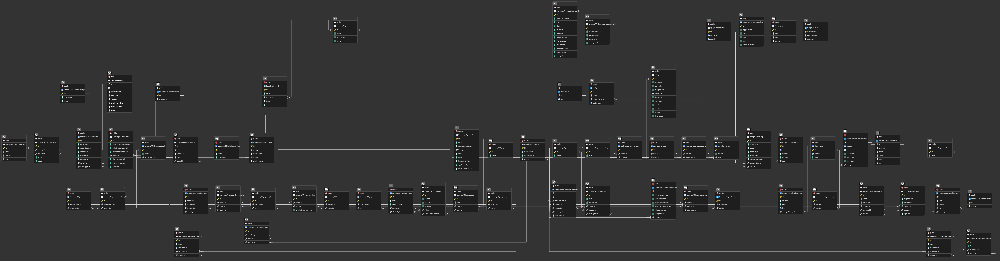

# Data Model

## 1. Database Diagram

## 2. Database Info

**Database type:**
postgres:16

**ORM:
Django**

## 3. Model to Table Mapping

| Model Name | Table Name |
|------------|------------|
| Coursework    | Book |
| Coursework    | Course |

| Property Name | Column Name | Data Type |
|---------------|-------------|-----------|
| Book              | id            | [PK]interger |
| Book              | name          | character    |
| Book              | course_id     | interger     |
| Book              | index         | interger     |
| Book              | description   | text         |
| Course            | id            | [PK]interger |
| Course            | name          | character    |
| Course            | date_created  | date         |
| Course            | active        | boolean      |

## 4. Relationship Examples

**One-to-one** (field name: )

| Model Name | Table Name | PK Column | FK Column |
|------------|------------|-----------|-----------|
| StudentPersonality    | NSSUser           | student_id          | id        |
| CohortInfo    | Cohort           | cohort_id          | id        |

**One-to-many** (field name: )

| Model Name | Table Name | PK Column | FK Column |
|------------|------------|-----------|-----------|
| Book     | Project     | id        | book_id |
| Capstone    | NSSUser           | student_id   | id        |

**Many-to-many** (field name: )

| Model Name | Table Name | PK Column | FK Column |
|------------|------------|-----------|-----------|
| StudentTeam  | NSSUserTeam  | id        | team_id |
| NSSUser      | NSSUserTeam  | id        | student_id |
| NSSUserTeam(junction) | NSSUserTeam   | team_id   | student_id   |
