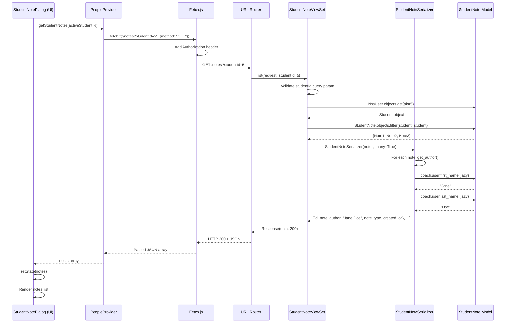
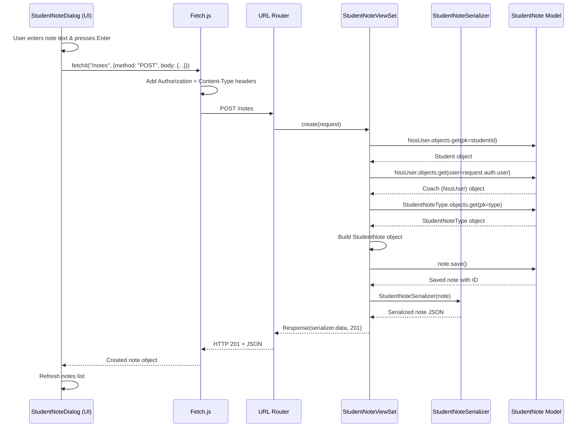

# Trace Notes: notes feature (learn-ops-api)

## Request Path

When a user opens the student notes dialog, here's the complete flow:

| Layer | File | Class / Function | What it does |
|-------|------|-----------------|--------------|
| UI dialog | learn-ops-client/src/components/dashboard/StudentNoteDialog.js | StudentNoteDialog component | Displays notes dialog; calls `getStudentNotes(activeStudent.id)` when dialog opens; also calls `createStudentNote()` on Enter key |
| API helper | learn-ops-client/src/components/people/PeopleProvider.js | getStudentNotes() | Calls `fetchIt(${Settings.apiHost}/notes?studentId=${studentId})` with GET method to fetch notes for a student |
| Fetch utility | learn-ops-client/src/components/utils/Fetch.js | fetchIt() | Makes HTTP GET request to API URL with Authorization token header; parses JSON response |
| URL router | learn-ops-api/LearningPlatform/urls.py | router.register() | Registers `r'notes'` route to StudentNoteViewSet; DRF DefaultRouter handles `/notes?studentId=X` GET requests |
| View | learn-ops-api/LearningAPI/views/student_note_view.py | StudentNoteViewSet.list(request) | Validates required `studentId` query param; fetches student by ID; queries notes: `StudentNote.objects.filter(student=student)`; serializes and returns |
| Serializer | learn-ops-api/LearningAPI/views/student_note_view.py | StudentNoteSerializer | Converts StudentNote instances to JSON; includes `note_type` as nested StudentNoteTypeSerializer object; excludes student/coach FK, includes computed `author` property |
| DB Query | learn-ops-api/LearningAPI/models/people/student_note.py | StudentNote.objects.filter(student=student) | Fetches all notes for a given student; ordered by `-created_on` (newest first); also evaluates `author` property which queries coach.user (lazy) |
| Response | learn-ops-api/LearningAPI/views/student_note_view.py | Response class | Returns HTTP 200 with JSON array: [{id, note, author, note_type: {id, label}, created_on}, ...] |

### Database Queries

**List notes:**
- Main query: `StudentNote.objects.filter(student=student)` — fetches all notes for a student
- Lazy query (N+1 risk): `self.coach.user.first_name` + `self.coach.user.last_name` — evaluated for each note's `author` property; evaluates coach relationship then user relationship

**Create note:**
- Query 1: `NssUser.objects.get(pk=studentId)` — fetch target student
- Query 2: `NssUser.objects.get(user=request.auth.user)` — fetch current coach
- Query 3: `StudentNoteType.objects.get(pk=note_type)` — validate note type exists
- Query 4: `note.save()` — INSERT into StudentNote table

---

## Sequence Diagram



### Alternative: Create Note



---

## Key Observations

### Authentication & Authorization
- **Token-based:** Authorization header contains `Token {user.token}` from browser localStorage
- **Permission check:** No explicit permission_classes set on StudentNoteViewSet (inherits ModelViewSet defaults; requires authentication via DRF)
- **Implicit authorization:** View validates that `request.auth.user` belongs to a coach, but doesn't check if coach can create notes for this student

### Request Validation
- **GET /notes:** Requires `studentId` query parameter; returns 400 if missing, 404 if student doesn't exist
- **POST /notes:** Requires `studentId`, `note`, `type` in request body; validates note type exists; logs operations with structlog

### N+1 Query Problem
- **List notes:** For each note, evaluates `author` property which triggers TWO database queries (coach FK + user FK)
- **Risk:** If there are 100 notes from 50 unique coaches, this evaluates 100+ queries instead of batching the joins
- **Fix:** Use `select_related('coach__user')` in queryset to pre-fetch coach and user in a single query

### Logging
- Uses structlog for structured logging: `logger.info("student_note_create_start", ...)`, etc.
- Logs are visible in server console and can be integrated with monitoring systems

### Response Fields
**List response:**
```json
[
  {
    "id": 42,
    "note": "Great progress on project X",
    "author": "Jane Doe",
    "note_type": {"id": 2, "label": "General Progress"},
    "created_on": "2025-09-30T14:32:15Z"
  }
]
```

**Create response (201):**
```json
{
  "id": 43,
  "note": "Needs review of algorithm implementation",
  "author": "Jane Doe",
  "note_type": {"id": 1, "label": "Technical"},
  "created_on": "2025-09-30T14:35:22Z"
}
```

### Ordering & Filtering
- Notes are **ordered by `-created_on`** (newest first) via model Meta
- Client-side filtering in StudentNoteDialog by note_type (dropdown filter in UI)
