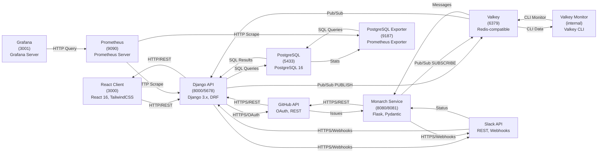

# System Map (AI)

## 1. System Diagram

```
# Learning Management System - Architecture Diagram

┌─────────────────────────────────────────────────────────────────────────────────────────────────────────┐
│                                     LEARNING MANAGEMENT SYSTEM                                          │
│                                    Complete Service Architecture                                        │
└─────────────────────────────────────────────────────────────────────────────────────────────────────────┘


                                         EXTERNAL SERVICES
                ┌───────────────────────────────────────────────────────────────────────────────┐
                │                                                                               │
                │       GitHub API                                      Slack API              │
                │    (OAuth, REST)                               (REST, Webhooks)             │
                │                                                                               │
                └─────────┬──────────────────────────────────────┬────────────────────────────┘
                          │                                      │
                 HTTPS/REST OAUTH                      HTTPS/Webhooks
                          │                                      │
        ┌─────────────────┴──────────────┬─────────────────────┬┴──────────────────────────┐
        │                                │                     │                           │
        │                         ┌──────▼──────────┐   ┌──────▼──────────┐              │
        │                         │   Django API    │   │  Monarch Svc    │              │
        │                         │   (Port 8000)   │   │ (Ports 8080/81) │              │
        │                         │   (Debug 5678)  │   │                 │              │
        │                         │                 │   │ Flask 3.0.3     │              │
        │                         │ Django 3.x      │   │ Pydantic        │              │
        │                         │ DRF             │   │ Valkey client   │              │
        │                         │ Pipenv          │   │                 │              │
        │                         │                 │   │                 │              │
        │                         └────┬────────┬──┘   └────────┬─────────┘              │
        │                              │        │              │                         │
        │              ┌───────────────┴─────────────────┐      │                         │
        │              │                                 │      │                         │
        │              │           HTTP/REST            │      │ Pub/Sub (SUBSCRIBE)    │
        │              │         (bidirectional)        │      │                         │
        │              │                                 │      │                         │
        │         ┌────▼────────────────────────────────▼─┐    │                         │
        │         │   React Client (Port 3000)            │    │                         │
        │         │   React 16, TailwindCSS, Radix UI     │    │                         │
        │         └──────────────────────────────────────┘    │                         │
        │                                                      │                         │
        │ HTTPS/REST     ┌──────────────────────────────────┐  │                         │
        │ (OAuth, Repos  │  Valkey Message Broker           │  │                         │
        │  Issues)       │  (Port 6379)                     │◄─┘                         │
        │                │  Valkey (Redis-compatible)      │   Pub/Sub (PUBLISH)       │
        │                └──────────┬───────────────────────┘                           │
        │                           │  ▲                                                │
        │                           │  │                                                │
        │                      Pub/Sub │  Pub/Sub                                        │
        │           (PUBLISH/SUBSCRIBE)│                                                │
        │                           │  │                                                │
        └───────────────────────────┼──┼─────────────────────────────────────────────────┘
                                    │  │
                 ┌──────────────────┘  │
                 │                     │
        ┌────────▼──────────┐  ┌───────┴────────────────────────────────┐
        │ Valkey Monitor     │  │                                        │
        │ (internal)         │  │      PostgreSQL Database              │
        │ Valkey CLI         │  │      (Port 5433)                      │
        │                    │  │      PostgreSQL 16                    │
        │ CLI monitor        │  │      learning_platform_data (volume)  │
        │ of Valkey          │  │                                        │
        │                    │  └────────┬────────────────────┬──────────┘
        └────────────────────┘           │                    │
                                         │ ▲                  │ ▲
                                    SQL Queries          SQL Queries
                                    (read/write)         (read stats)
                                         │ │                  │ │
                 ┌───────────────────────┴─┼──────────────────┴─┼──────┐
                 │                        │                    │      │
                 │                   ┌────┴────────┐    ┌──────┴──────▼┐
                 │                   │  Django API │    │ PostgreSQL   │
                 │                   │  ↕ Database │    │ Exporter     │
                 │                   │             │    │ (Port 9187)  │
                 │                   └──────────────┘    │ Prometheus   │
                 │                                       │ Exporter    │
                 │                                       └──────┬──────┘
                 │                                              │
                 │                                         HTTP Scrape
                 │                                         /metrics
                 │                                              │
                 │                                         ┌────▼──────────┐
                 │                                         │  Prometheus    │
                 │                                         │  (Port 9090)   │
                 │                                         │  Prometheus    │
                 │                                         │  Server        │
                 │                                         │  Time-series   │
                 │                                         │  Database      │
                 │                                         └────┬──────────┘
                 │                                              │
                 │                                         HTTP Scrape
                 │                                         /metrics
                 │                                              │
                 └──────────────────────────────────────────────┤
                                                                │
                                                         ┌──────▼──────────┐
                                                         │   Grafana        │
                                                         │   (Port 3001)    │
                                                         │   Grafana Server │
                                                         │   Dashboards     │
                                                         └──────────────────┘


## Connection Matrix

| From | To | Connection Type | Protocol | Direction |
|------|-----|-----------------|----------|-----------|
| React | Django API | HTTP/REST | HTTP/1.1 | Bidirectional |
| Django API | GitHub API | HTTPS/REST + OAuth | HTTPS | Bidirectional |
| Django API | Slack API | HTTPS/Webhooks | HTTPS | Bidirectional |
| Django API | PostgreSQL | SQL Queries | PostgreSQL Protocol | Bidirectional |
| Django API | Valkey | Pub/Sub (PUBLISH) | Redis Protocol | Bidirectional |
| Monarch | Valkey | Pub/Sub (SUBSCRIBE) | Redis Protocol | Unidirectional |
| Monarch | GitHub API | HTTPS/REST | HTTPS | Unidirectional |
| Monarch | Slack API | HTTPS/Webhooks | HTTPS | Unidirectional |
| Valkey Monitor | Valkey | CLI Monitoring | Redis Protocol | Bidirectional |
| PostgreSQL Exporter | PostgreSQL | SQL Queries (read stats) | PostgreSQL Protocol | Unidirectional |
| Prometheus | Django API | HTTP Scrape /metrics | HTTP | Unidirectional |
| Prometheus | PostgreSQL Exporter | HTTP Scrape /metrics | HTTP | Unidirectional |
| Grafana | Prometheus | HTTP API Queries | HTTP | Unidirectional |
```



