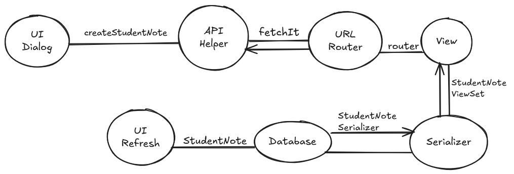

# Trace Notes - Create a Student Note

## Request Path

| Layer | File | Class / Function | What it does |
|-------|------|-----------------|--------------|
| UI dialog | StudentNoteDialog.js | createStudentNote | Handles the form for creating a new student note. |
| API helper | Fetch.js | fetchIt | Takes the API request, authenticates the user, and then determines what to do with it based on the request type (GET, POST, PUT, or DELETE). |
| URL router | urls.py | router | Determines the proper routing for the API requests related to student notes. |
| View | student_note_view.py | StudentNoteViewSet | Handles the API requests for creating the student note. |
| Serializer | student_note_view.py | StudentNoteSerializer |Converts the student note data between Python and JSON formats. |
| DB | student_note.py / student_note_view.py | StudentNote | Handles the database operations for the student note. Saves the new note to the database after it is created. |
| UI refresh | PeopleProvider.js  | getStudentNotes | Refreshes the list of notes for a student after a new note is created. |

## Sequence Diagram

[Excalidraw link](https://excalidraw.com/#json=upZtRdZWH89i-SQdV-7qF,_vnn1xN30dMk_L1nkn62rA)

